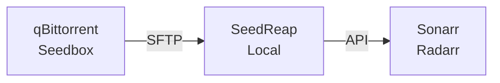

# SeedReap

<p align="center">
  
</p>

<p align="center">
  <em>Reap what your seedbox has sown.</em>
</p>

---

SeedReap is a Go application that syncs completed downloads from remote seedboxes to local storage using
high-speed parallel SFTP transfers (via rclone), then triggers app imports.

**Inspired by [seedsync](https://github.com/ipsingh06/seedsync)** - Rewritten in Go with multi-threaded
transfers and additional features.

## Features

- :zap: **High-Speed Parallel Transfers** - Uses rclone with multi-threaded streams for fast file downloads
  (configurable streams per file)
- :electric_plug: **Multiple Download Client Support** - Extensible interface for download clients (qBittorrent
  supported, easily extensible)
- :file_folder: **Per-File Sync** - Syncs individual files as they complete, even before the entire torrent finishes
- :tv: **App Integration** - Automatically triggers imports in Sonarr, Radarr, and other *arr apps
- :bar_chart: **Web UI** - Built-in dashboard with real-time progress, transfer speeds, and ETA
- :gear: **API** - RESTful API for integration and monitoring

## How It Works



1. **Monitor** - Polls configured download clients for completed downloads
2. **Sync** - Uses rclone with multi-threaded SFTP transfers from remote to local staging
3. **Move** - Moves synced files to the final destination path
4. **Import** - Triggers the appropriate app to import the files

## Quick Start

=== "Docker"

```bash
docker run -d \
-v /path/to/config.yaml:/config/config.yaml \
-v /path/to/ssh:/config/ssh:ro \
-v /downloads:/downloads \
-p 8423:8423 \
ghcr.io/seedreap/seedreap:latest
```

=== "Binary"

```bash
# Install
go install github.com/seedreap/seedreap@latest

# Run
seedreap --config config.yaml
```

See the [Installation Guide](getting-started/installation.md) for detailed instructions.

## License

Apache 2.0 - See [LICENSE](https://github.com/seedreap/seedreap/blob/main/LICENSE) for details.
